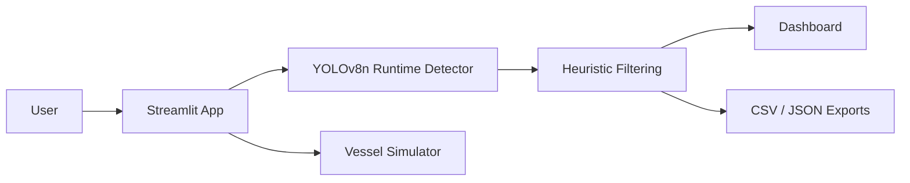

# Smart Marine Project

[](https://github.com/girishk03/smart_marine_project/actions/workflows/ci.yml)
[](https://www.python.org/)
[](LICENSE)

An experimental computer-vision dashboard for exploring marine-debris detection workflows, result visualization, and simulated vessel missions.

## Project Overview

Smart Marine Project combines a Streamlit interface with an Ultralytics object detector. Users can inspect images, process batches, experiment with webcam input, review session analytics, export detection history, and explore a software-only vessel simulator.

This repository is a prototype and research portfolio project. It is not a production monitoring system or an autonomous-vessel controller.

## Problem Statement

Reviewing marine imagery manually is slow. Object detection can help investigators prioritize images that may contain bottles, cups, or similar debris. However, a general-purpose object detector cannot determine material composition reliably, so its output must remain advisory and subject to human review.

## What This Project Actually Does

- Runs a pretrained YOLOv8n model in the primary Streamlit application.
- Treats selected COCO object classes—such as `bottle`, `cup`, `wine glass`, `bowl`, and `vase`—as possible debris candidates.
- Applies heuristic class and geometry filtering to selected inference paths.
- Supports single-image, batch-image, and browser webcam workflows.
- Displays session-level analytics and exports detection history as CSV or JSON.
- Simulates GPS positions, navigation, debris collection, and vessel telemetry in software.

## What It Does Not Claim

- It does not identify plastic material composition directly.
- It does not provide a verified accuracy score for the current runtime pipeline.
- It does not ship the historical custom YOLOv5m weights or training dataset.
- It does not demonstrate physical vessel control, real GPS hardware integration, or field deployment.
- It should not make cleanup, safety, navigation, or enforcement decisions without human review.

## Live / Demo Status

The supported path is local execution. Render configuration is included, but no continuously available public deployment is claimed. The runtime model may be downloaded by Ultralytics on first use, requiring network access and additional startup time.

## Screenshots

| Workflow | Preview |
| --- | --- |
| Single-image interface |  |
| Example detection result |  |
| Webcam interface |  |
| Session analytics |  |
| Vessel simulation |  |

Screenshots illustrate application workflows; they are not evaluation evidence.

## Architecture



## Runtime Model

The main application loads `yolov8n.pt` through the Ultralytics package. If the file is absent, Ultralytics may download the pretrained model automatically. No runtime weight file is committed to this repository.

The runtime detector is pretrained on COCO object categories. It is not a custom material classifier. The application maps selected object categories to a display label of `plastic`, which is a project heuristic rather than a model prediction about material.

## Historical Training Notes

The repository contains plots and `results.csv` from a historical 50-epoch YOLOv5m experiment. Its best recorded values include mAP@0.5 of approximately `0.208` and mAP@0.5:0.95 of approximately `0.144`. These artifacts do not establish performance for the current YOLOv8n runtime pipeline.

The historical weights, dataset snapshot, and complete runnable training workflow are absent. Consequently, the experiment is not reproducible from this repository and is retained only as historical context.

## Observed Performance

Six committed CPU benchmark reports record approximately `10.77–18.68 FPS` and mean inference latency of approximately `53.5–92.8 ms` on the recorded Apple CPU environment. Tail latency exceeded 100 ms in some runs. These reports recorded zero detections per frame, so they are useful as limited timing observations—not end-to-end detection-performance evidence.

No supported GPU benchmark is included.

## Detection Logic

1. The runtime model produces general COCO object detections.
2. The application keeps selected container-like classes as possible debris candidates.
3. Some inference paths apply heuristic filters based on class, geometry, position, and confidence.
4. A legacy YOLOv5 path boosts displayed confidence by up to 6×, capped at 0.95; very low scores use a smaller multiplier.
5. Results are shown for operator review and may be exported from session history.

Confidence boosting is a presentation heuristic. It is not probability calibration and must not be interpreted as improved model accuracy.

## Simulator Module

`vessel_modules/` provides a software simulator for GPS coordinates, navigation state, camera imagery, collection counts, and telemetry. It is intended for UI and workflow experimentation. It does not communicate with motors, autopilots, GPS receivers, or other vessel hardware.

## Setup Guide

### Prerequisites

- Python 3.11 recommended
- Network access for the first model download
- A webcam and browser permission for webcam mode

```bash
git clone https://github.com/girishk03/smart_marine_project.git
cd smart_marine_project
python3 -m venv .venv
source .venv/bin/activate
python -m pip install --upgrade pip
pip install -r requirements.txt
```

Windows activation:

```powershell
.venv\Scripts\activate
```

## Run Streamlit App

```bash
streamlit run reliable_web_app.py
```

Open `http://localhost:8501`. The first run may download YOLOv8n weights. Webcam behavior depends on browser permissions and local media support.

## Testing

Run the package tests with:

```bash
pip install pytest
pytest -q smart_marine_project/tests
```

Current local result: **7 passed and 3 skipped**. The skipped tests require optional historical model weights that are not distributed with the repository. No tests are skipped to conceal a known failure.

## CI/CD

GitHub Actions installs runtime and test dependencies, compiles and imports the Streamlit entry point, checks the local Streamlit health endpoint, and runs the package pytest suite. It does **not** claim webcam, physical hardware, browser interaction, model-quality, or deployment coverage.

The repository also includes `render.yaml`, `Procfile`, and `runtime.txt`. Their presence documents a deployment configuration but does not prove a live or continuously healthy service.

## Dataset and Model Provenance

The dataset configuration identifies Roboflow workspace `smart-marine-project`, project `plastic-only-detection`, version `1`. The repository does not contain a source URL, immutable manifest, dataset snapshot, or sufficient attribution to independently verify the dataset license and image counts.

The runtime and historical model boundaries, license considerations, and reproducibility gaps are documented in [docs/provenance.md](docs/provenance.md).

## Repository Hygiene

Generated detections, uploads, benchmark output, Streamlit state, caches, and training runs remain outside version control. Historical benchmark JSON files and model-training logs are intentionally retained as evidence, while generated detections, uploaded copies, and unreferenced report graphs have been removed.

## Limitations

- Container-shaped objects are not necessarily plastic or marine debris.
- Plastic outside the selected COCO classes may be missed.
- Heuristic filters can introduce false positives and false negatives.
- Displayed boosted confidence is not calibrated probability.
- Historical training cannot currently be reproduced.
- Benchmarks do not measure useful detections and do not support accuracy claims.
- Webcam and model-download behavior depend on the local environment.
- The vessel module is simulation-only.

## Future Improvements

- Publish an immutable, licensed dataset manifest with train/validation/test splits.
- Add a reproducible training and evaluation pipeline.
- Package versioned model weights with checksums or a documented model registry.
- Replace material heuristics with a validated marine-debris taxonomy.
- Add calibrated confidence and error analysis across representative marine imagery.
- Repair the failing tests and run the complete suite in CI.
- Add Streamlit startup, browser, and deployment smoke tests.
- Remove generated artifacts from Git history in a dedicated cleanup PR.
- Integrate physical hardware only behind explicit safety controls and field validation.

## License

Project-authored source code is provided under the [MIT License](LICENSE). Datasets, pretrained models, and third-party dependencies retain their own licenses; see [docs/provenance.md](docs/provenance.md) before redistribution or commercial use.
