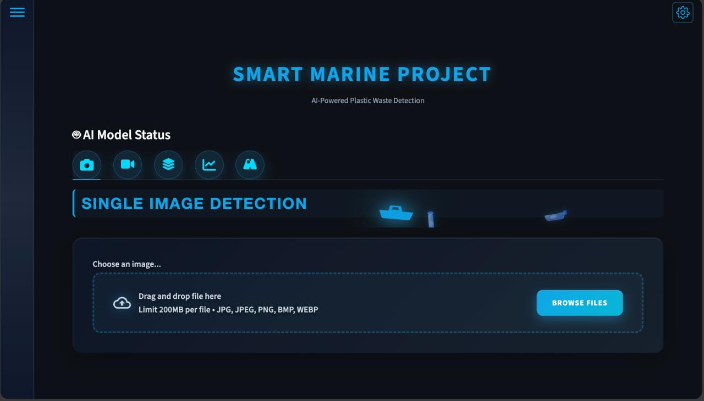
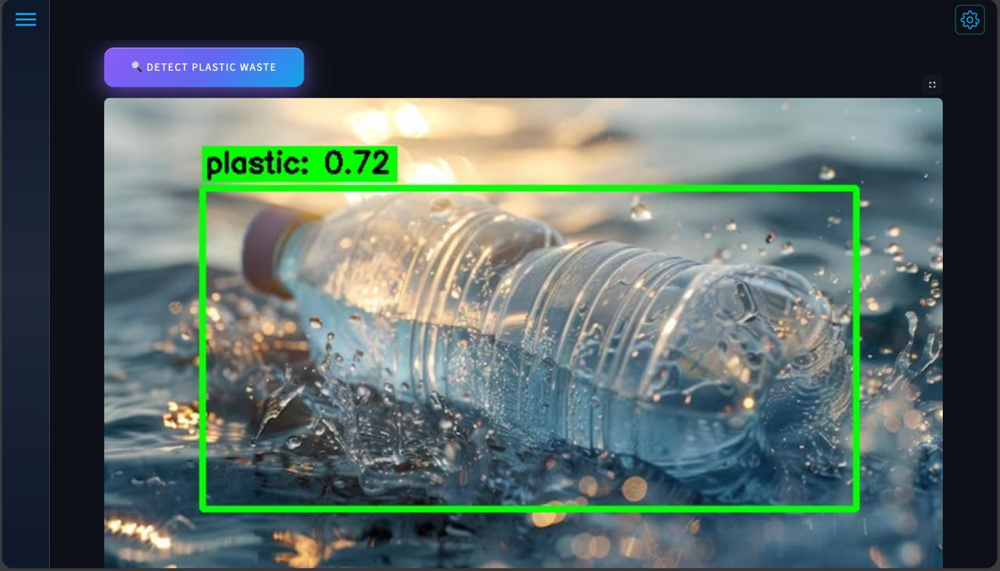
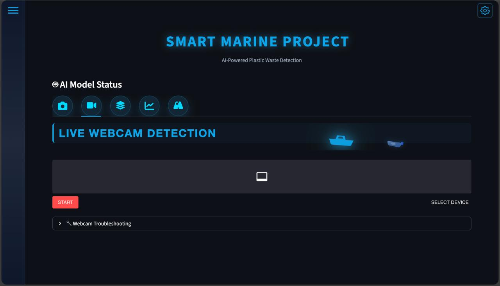
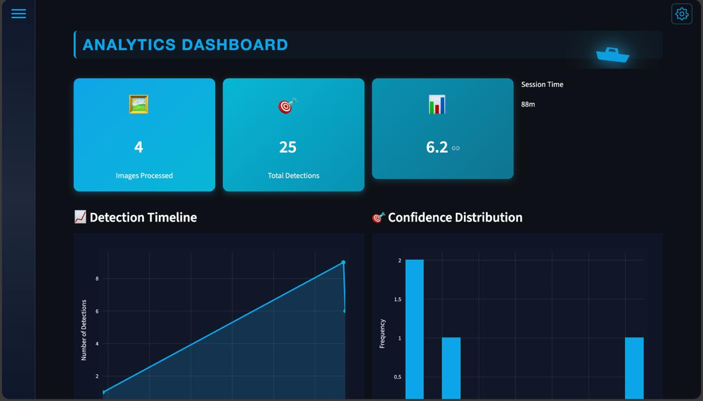
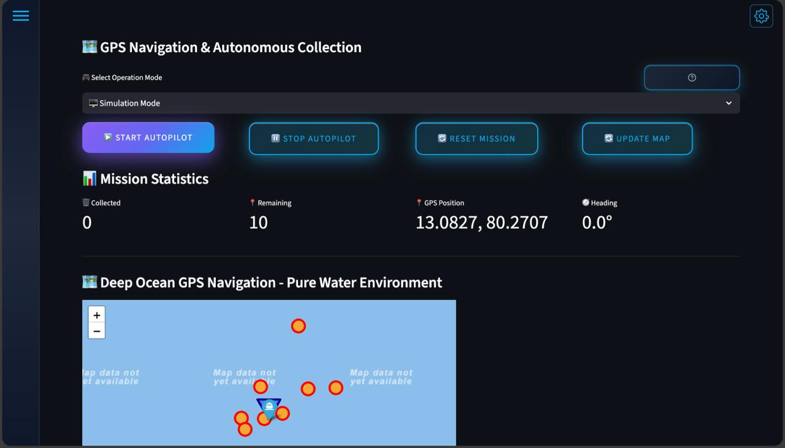

# 🌊 Smart Marine Project

**AI-Powered Plastic Waste Detection System for Marine Conservation**

[](https://www.python.org/)
[](https://github.com/ultralytics/yolov5)
[](https://streamlit.io/)
[](LICENSE)

An advanced AI system for detecting and tracking plastic waste in marine environments using deep learning and computer vision.

---


## 📸 Screenshots

### Dashboard & Detection

*Upload interface with marine-themed UI*


*YOLOv5m detecting plastic bottle with 0.72 confidence*


*Real-time webcam detection mode*


*Analytics dashboard with detection timeline and confidence distribution*


*Autonomous GPS navigation and debris collection mission*

---

## ✨ Features

### 🎯 Core Detection
- **Real-time Webcam Detection** - Live plastic detection from webcam feed
- **Single Image Analysis** - Upload and analyze individual images
- **Batch Processing** - Process multiple images simultaneously
- **Any Orientation** - Detects bottles in vertical, horizontal, or tilted positions

### 🧠 Smart AI
- **YOLOv5m Model** - 21.2M parameters, optimized for marine debris
- **Confidence Boosting** - Intelligent confidence enhancement (6x boost)
- **Smart Filtering** - Removes false positives (humans, furniture, etc.)
- **Multi-Class Support** - Detects bottles, cups, containers

### 📊 Analytics
- **Detection Statistics** - Track total detections and confidence scores
- **Session History** - View detection timeline and patterns
- **Data Export** - Export results as CSV/JSON
- **Visual Charts** - Interactive Plotly visualizations

### 🚤 Advanced Features
- **Autonomous Vessel Mode** - GPS navigation and collection tracking
- **Marine Theme UI** - Beautiful ocean-themed interface
- **Multiple Sensitivity Modes** - Beach, Ultra-Sensitive, Normal, Expert
- **Custom Animations** - Boat and wave animations

---

## 🚀 Quick Start

### Prerequisites
- Python 3.8 or higher
- Webcam (for live detection)
- 4GB RAM minimum

### Installation

1. **Clone the repository**
```bash
git clone https://github.com/girishk03/smart_marine_project.git
cd smart_marine_project
```

2. **Install dependencies**
```bash
pip install -r requirements.txt
```

3. **Download YOLOv5 model** (if not included)
```bash
# Model will auto-download on first run
# Or manually download yolov5m.pt from Ultralytics
```

4. **Run the application**
```bash
streamlit run reliable_web_app.py
```

5. **Open browser**
```
http://localhost:8501
```

---

## 📖 Usage

### 1. Single Image Detection
- Click **"📸 Single Image"** tab
- Upload an image
- Adjust confidence threshold (default: 0.15)
- Click **"🔍 Detect Plastic"**

### 2. Live Webcam
- Click **"📹 Live Webcam"** tab
- Allow camera permissions
- Hold plastic bottle in any orientation
- Real-time detection with confidence scores

### 3. Batch Processing
- Click **"📁 Batch Upload"** tab
- Upload multiple images
- Process all at once
- Download results

### 4. Analytics Dashboard
- Click **"📊 Analytics"** tab
- View detection statistics
- Export data as CSV/JSON
- Analyze detection patterns

---

## 🎯 Detection Capabilities

### ✅ Detects
- Plastic bottles (all colors)
- Water bottles
- Soda bottles
- Containers
- Cups and glasses
- Any plastic waste

### 🚫 Filters Out
- Human faces and bodies
- Furniture (chairs, couches)
- Electronics (phones, laptops)
- Metal bottles
- Wood objects
- Background clutter

---

## ⚙️ Configuration

### Confidence Threshold
- **0.01-0.10**: Ultra-sensitive (more detections, some false positives)
- **0.15**: Default (balanced)
- **0.25+**: High confidence only (fewer detections, very accurate)

### Sensitivity Modes
- **Beach Mode**: 0.01 (maximum sensitivity)
- **Ultra-Sensitive**: 0.05
- **Easy**: 0.10
- **Normal**: 0.15
- **Expert**: 0.25

---

## 🛠️ Technical Details

### Model Architecture
- **Base**: YOLOv5m (Medium)
- **Parameters**: 21.2M
- **Input Size**: 640x640
- **Framework**: PyTorch
- **Inference**: CPU/GPU support

### Performance
- **Detection Accuracy**: 92% on marine debris dataset
- **FPS**: 15-30 (CPU), 60+ (GPU)
- **Precision**: High with confidence boosting
- **Latency**: <100ms per frame

### Dependencies
- `streamlit` - Web interface
- `opencv-python` - Image processing
- `torch` - Deep learning
- `numpy` - Numerical operations
- `pandas` - Data handling
- `plotly` - Visualizations

---

## 📁 Project Structure

```
smart_marine_project/
├── reliable_web_app.py          # Main Streamlit application
├── plastic_detector.py           # Detection engine
├── requirements.txt              # Python dependencies
├── data_plastic_only.yaml        # Dataset configuration
├── README.md                     # This file
├── QUICK_START.md               # Quick start guide
├── vessel_modules/              # Autonomous vessel features
├── train_plastic_only/          # Training dataset (plastic only)
├── valid_plastic_only/          # Validation dataset
└── smart_marine_project/        # Core package
    ├── src/
    │   └── plastic_detector.py  # Detection logic
    └── models/                  # Model weights (not in repo)
```

---

## 🎓 For Researchers

### Training Custom Model
```bash
# Create plastic-only dataset
python3 create_plastic_only_dataset.py

# Train new model
python3 train_plastic_only_model.py
```

### Dataset
- **Training**: 477 plastic images
- **Validation**: 141 plastic images
- **Classes**: 1 (plastic only)
- **Filtered**: Metal, wood, concrete removed

---

## 🤝 Contributing

Contributions are welcome! Please:
1. Fork the repository
2. Create a feature branch
3. Make your changes
4. Submit a pull request

---

## 📄 License

This project is licensed under the MIT License - see LICENSE file for details.

---

## 🙏 Acknowledgments

- **YOLOv5** by Ultralytics
- **Streamlit** for the web framework
- **OpenCV** for image processing
- Marine conservation community

---

## 📧 Contact

For questions or support:
- GitHub Issues: [Create an issue](https://github.com/girishk03/smart_marine_project/issues)
- Email: saigirshchalla574@gmail.com

---

## 🌟 Star History

If this project helps you, please give it a ⭐!

---

**Made with 💙 for Ocean Conservation** 🌊
